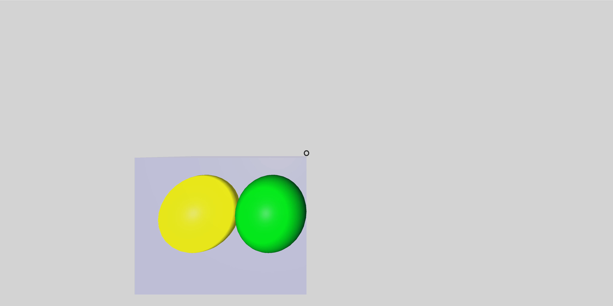
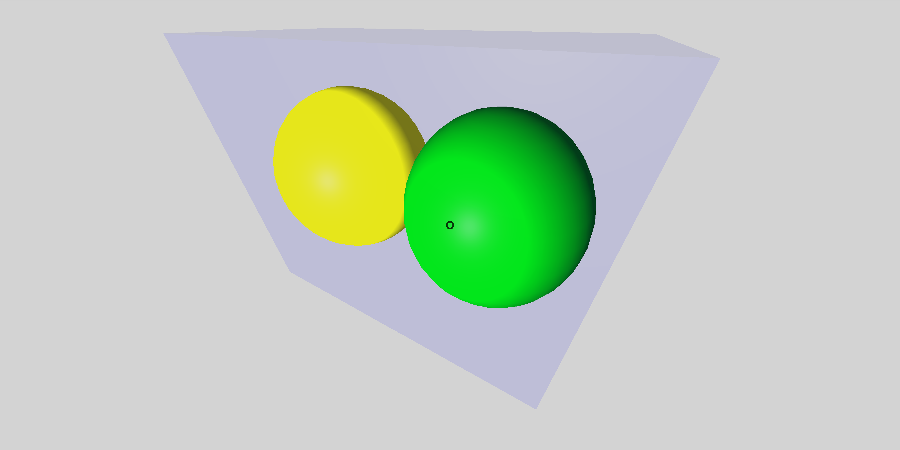

*[Back to the main page](../README.md)*

## Playing towards my 3D plots

I got my first scatterplot. Let's go for more of them.
But now, I'm going to write my own code for that.

### Inserting spheres in the DOM

I start by learning to insert A-frame elements in the DOM.
Useful documentation:

* [Getting entities by querying and traversing](https://aframe.io/docs/0.6.0/introduction/javascript-events-dom-apis.html#getting-entities-by-querying-and-traversing).
Use of `.querySelector()` for locating elements in the DOM.

* [Adding a component with .setAttribute()](https://aframe.io/docs/0.6.0/core/entity.html#setattribute-attr-value-componentattrvalue). Use of `.setAttribute()` for setting attributes of an element.

The simplest code I write, which inserts to spheres in a scene,
is as follows:

```javascript
function sphere(parent, x, y, z, radius, color){
  var entity = document.createElement('a-sphere');
  entity.setAttribute('position',
    x.toString() + ' ' + y.toString() + ' ' + z.toString());
  entity.setAttribute('radius', radius.toString());
  entity.setAttribute('color', color);
  parent.appendChild(entity);
};

function main() {
  var sceneEl = document.querySelector('a-scene');
  sphere(sceneEl, -2, 1.25, -5, 1.25, 'yellow');
  sphere(sceneEl, 2, 1.25, -5, 1.25, 'green');
};

document.addEventListener('DOMContentLoaded', main);
```

The `sphere` function just produces an A-frame sphere entity
(using `createElement`),
sets its position, radius and color
(using `setAttribute` to set its attributes),
and inserts it into the DOM, as a child of `parent`.

The main code just gets the `a-scene` element
(which is defined in `index.html`, and should be unique),
and inserts two spheres in it.

### Using a framing box

Since I'm interested in producing a 3D scatterplot,
I'm going to have to frame it into a box,
which will define the dimensions of the plot.
So, I'm going to explore how to produce a box element,
and insert some spheres into it. The resulting code is as follows:

```javascript
// Produce a box, insert it in parent element, return it
function box(parent, x, y, z, lenght_x, lenght_y, lenght_z, color){
  var entity = document.createElement('a-box');
  entity.setAttribute('position', {x: x, y: y, z: z});
  entity.setAttribute('geometry', {
    'width': lenght_x,
    'height': lenght_y,
    'depth': lenght_z
  });
  entity.setAttribute('material', {
    'color': color,
    'transparent': true,
    'opacity': 0.1
  });
  parent.appendChild(entity);
  return(entity);
};

// Produce a sphere, insert it in parent element, return it
function sphere(parent, x, y, z, radius, color){
  var entity = document.createElement('a-sphere');
  entity.setAttribute('position', {x: x, y: y, z: z});
  entity.setAttribute('geometry', {'radius': radius});
  entity.setAttribute('material', {'color': color});
  parent.appendChild(entity);
  return(entity);
};

function main() {
  var sceneEl = document.querySelector('a-scene');
  var boxEl = box(sceneEl, -2, 0, -5, 4, 3, 2, 'blue')
  sphere(boxEl, -1, 0, 0, 1, 'yellow');
  sphere(boxEl, 1, 0, 0, 1, 'green');
};

document.addEventListener('DOMContentLoaded', main);
```

The code is similar to the first exploration above,
but now I have separate functions for producing the framing box (`box`)
and the spheres.
I'm also exploring other ways to set the attributes,
such as setting directly `position`, `geometry` and `material`
(instead of, for example,
joining all position coordinates into a string, as I did before).
Important notice: the coordinates of the spheres are now
relative to the box, since they are defined as their children.

See below two screenshots of the scene with the
framing box and the two spheres.




